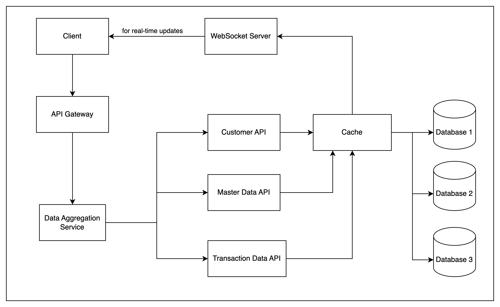

### Client:
 - Client represents application that interacts with the system. It receives real-time updates via the WebSocket Server, ensuring the data is always current.

### API Gateway:
- API Gateway will receive request entry point for all client requests. It routes these requests to the appropriate backend services

### Data Aggregation Service:
- Data Aggregation service will collect and processes data from multiple APIs (Customer, Master Data, Transaction) and combines or computes the results before sending the final output back to the client.

### WebSocket Server:
- WebSocket Server enables real-time communication between the client and cache. It pushes updates to the client whenever new data is available, ensuring continuous synchronization.

### Customer API:
- Customer API handles customer-related data, interacting with Database 1 for storage and retrieval. It can also access the Cache for faster data retrieval when needed.

### Master Data API:
- Master Data API manages core data shared across the system It communicates with Database 2 and uses the Cache to quickly retrieve frequently used data.

### Transaction Data API:
- Transaction Data API handles transactional information, It interacts with Database 3 and leverages the Cache to improve response times.

### Cache:
- Cache is a temporary storage layer that accelerates data retrieval. Instead of querying the databases for every request, the system first checks the cache for available data, reducing database load and improving performance.

### Database:
- Database 1: Stores customer-related data.
- Database 2: Stores master data.
- Database 3: Stores transactional data.
